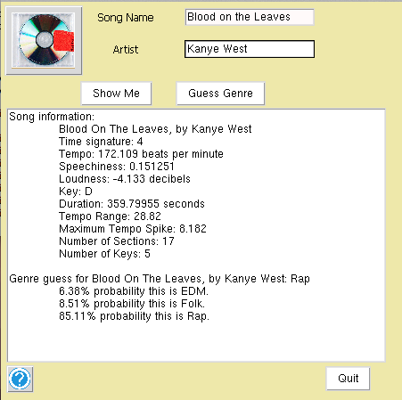

## MuNal: Genre categorization with Decision Trees

An application of the RPart Decision Tree package to classify music from Echonest's music database by genre, based on a set of attributes that includes tempo, key, speechiness, and duration.

_Production team: Megan Barnes, Zakir Gowani, Michael Lizza_

</img>

#### To build and run:
```
$ python MuNal.py
```
  This script presents a TkInter GUI which interfaces with a pickled decision tree file to classify input songs into one of three broad genres (Rap, EDM, Folk). We thank [The Echo Nest](http://echonest.com/) for access to their music data, as well as Terry Therneau, Beth Atkinson, and Brian Ripley for their [RPart decision tree package](http://cran.r-project.org/web/packages/rpart/index.html).


To test if our database generation scripts work on your system:
```
$ sh app/test_all.sh
```

#### Prerequisite packages:
- pyen: Available [here](https://github.com/plamere/pyen)
- sqlite3
- rpy2: Available [here](http://sourceforge.net/projects/rpy/files/rpy2/2.3.x/)
- urllib2, urlparse
- pickle
- tkinter and ttk

Choose highest versions for each of the packages above, especially for rpy2. Be sure that your R version is up to date (at least version 3) before downloading rpy2.
This application was written in Python 2.X and will not run under default Python3.x settings.
